# FORTIS-ICS
### Adaptive Cryptographic Security Architecture for Industrial Cyber-Physical Systems

<p align="center">


</p>

<p align="center">
  <b>A modular embedded security architecture for protecting telemetry in Industrial Cyber-Physical Systems.</b>
</p>

---

## 📌 Overview

**FORTIS-ICS** is an adaptive cryptographic security architecture designed for
Industrial Cyber-Physical Systems (ICPS).

The architecture separates the **application/telemetry node** from the
**security enforcement node**. Instead of allowing the main embedded device
to independently determine whether its data should be trusted, a dedicated
security coprocessor performs authentication and produces the security
decision.

The current prototype uses:

- **ESP32 DevKit V1** as the main application and telemetry node
- **STM32F103C8T6 Blue Pill** as the dedicated security coprocessor
- **HMAC-SHA256** for telemetry authentication
- **AES** for protected data transmission
- **Python backend + web dashboard** for reception, decryption,
  monitoring and visualization

The architecture is intentionally **sensor-independent**. The current
sensor is only a representative telemetry source and can be replaced or
expanded with multiple industrial sensors.

---

## 🎯 Project Objectives

FORTIS-ICS is designed to:

- Establish an independent security verification layer.
- Authenticate embedded telemetry using HMAC-SHA256.
- Detect modification of authenticated packets.
- Separate application processing from security enforcement.
- Dynamically associate security decisions with cryptographic policies.
- Prevent unauthenticated data from entering the protected-data pipeline.
- Apply cryptographic protection only after authorization.
- Provide structured security responses for every processed packet.
- Support extension to multiple sensors and industrial edge nodes.
- Provide measurable cryptographic and security performance metrics.

---

# 🏗️ System Architecture

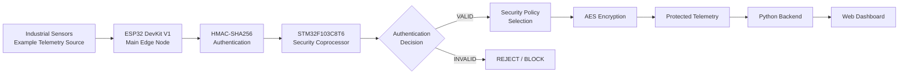

### Core Principle

The architecture establishes a security boundary between:

```text
Application Processing
        │
        ▼
Security Verification
        │
        ▼
Cryptographic Authorization
        │
        ▼
Protected Communication
```

The **Blue Pill acts as the security gate** between application-generated
telemetry and the protected communication pipeline.

---

# 🔐 Security Architecture

The primary security mechanism is based on separating authentication from
application processing.

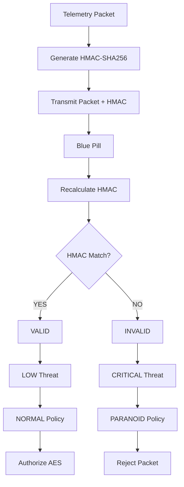

This ensures that packet integrity is verified **before protected processing
is authorized**.

---

# 🧩 System Components

| Component | Responsibility |
|---|---|
| **ESP32 DevKit V1** | Main application and telemetry node |
| **STM32F103C8T6** | Dedicated security coprocessor |
| **HMAC-SHA256** | Message authentication and integrity verification |
| **AES** | Protected telemetry encryption |
| **UART** | ESP32 ↔ Blue Pill security communication |
| **Python Backend** | Packet reception and decryption |
| **Web Dashboard** | Monitoring and visualization |
| **MQ-2** | Example telemetry source |

> **Sensor independence:** The MQ-2 is only used as a representative
> telemetry source. The architecture can support many sensors without
> changing the fundamental security mechanism.

---

# 🖥️ Edge Node — ESP32

The ESP32 acts as the main application node.

### Responsibilities

- Generate telemetry
- Maintain packet counters
- Collect runtime information
- Generate HMAC-SHA256 authentication tags
- Send verification requests to the Blue Pill
- Receive security decisions
- Trigger the appropriate cryptographic operation
- Simulate packet tampering during testing
- Forward authorized protected telemetry

### Runtime Data

The telemetry packet can contain information such as:

- Packet version
- Node ID
- Packet counter
- Uptime
- Runtime timing
- Free heap
- Sensor value
- Sensor status
- Runtime state

The telemetry structure is intentionally extensible.

---

# 🛡️ Security Coprocessor — STM32 Blue Pill

The **STM32F103C8T6 Blue Pill** operates independently as the security
coprocessor.

Its primary responsibilities are:

1. Receive authentication requests.
2. Parse the security frame.
3. Extract the telemetry packet.
4. Extract the received HMAC.
5. Calculate HMAC-SHA256 independently.
6. Compare the calculated and received authentication values.
7. Determine packet authenticity.
8. Assign a threat level.
9. Select the corresponding security policy.
10. Return a structured security decision.

### Security Boundary

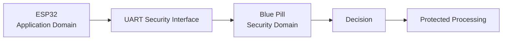

The security node therefore provides an independent decision point between
the application and protected communication layers.

---

# 🔑 HMAC-SHA256 Authentication

Each packet is authenticated before it is accepted as trusted telemetry.

Conceptually:

$$
HMAC = HMAC\text{-}SHA256(Key,\ Packet)
$$

The ESP32 generates the authentication value.

The Blue Pill independently performs the same calculation.

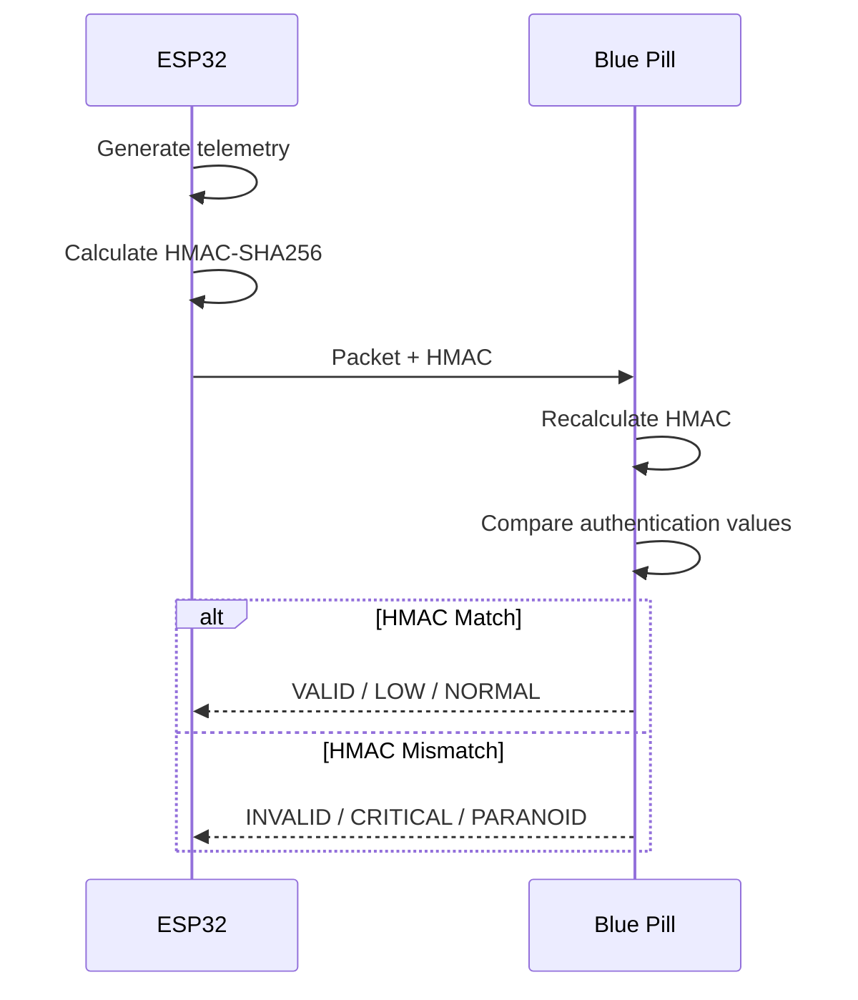

A packet is considered authenticated only when the independently calculated
HMAC corresponds to the received authentication value.

---

# 📡 Security Protocol

The current verification request follows the structure:

```text
VERIFY|PACKET|HMAC
```

Example:

```text
VERIFY|PKT,1.0,MAIN_01,...|<64-character-HMAC>
```

The Blue Pill processes the request and returns a structured security
response.

### Response Structure

```text
SECURITY,PKT=<packet-number>,<packet-id>,<status>,<threat>,<policy>
```

Example valid response:

```text
SECURITY,PKT=25,MAIN_01,VALID,LOW,NORMAL
```

Example invalid response:

```text
SECURITY,PKT=26,MAIN_01,INVALID,CRITICAL,PARANOID
```

---

# 🔄 Adaptive Security Policy

FORTIS-ICS uses security policies as the link between authentication results
and cryptographic enforcement.

The current prototype demonstrates:

| Authentication | Threat | Policy | Result |
|---|---|---|---|
| `VALID` | `LOW` | `NORMAL` | Continue |
| `INVALID` | `CRITICAL` | `PARANOID` | Reject |

The policy system is designed to be extended with additional states.

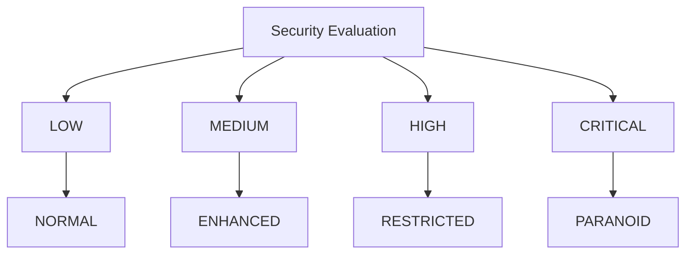

Future policies may control:

- Cryptographic strength
- Encryption mode
- Re-authentication frequency
- Key usage
- Packet acceptance
- Additional verification
- Security logging
- Communication restrictions

---

# ⚔️ Tamper Detection

FORTIS-ICS includes a controlled attack simulation for evaluating the
authentication mechanism.

The attack works by modifying the telemetry **after the HMAC has already
been generated** while retaining the original HMAC.

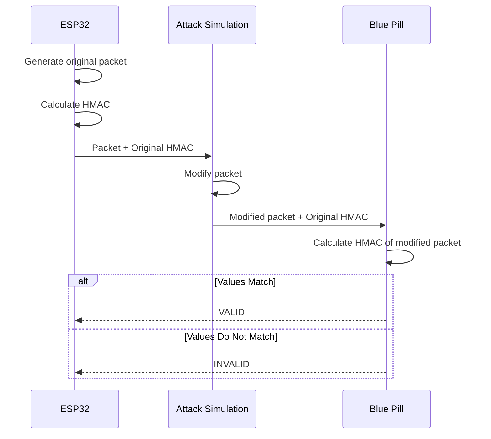

### Example

Original:

```text
GAS=<original-value>
HMAC = H(original packet)
```

Tampered:

```text
GAS=4095
HMAC = H(original packet)
```

The Blue Pill calculates:

```text
H(modified packet)
```

Since:

```text
H(modified packet) != H(original packet)
```

the authentication check fails.

---

# 🚨 Attack Response

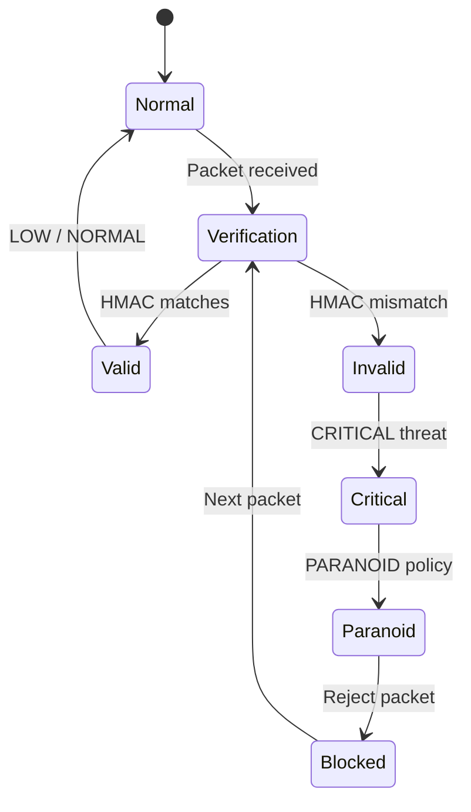

The important property is that a detected attack does not permanently stop
the system.

A subsequent legitimate packet can return the system to its normal
authenticated state.

---

# 🔐 Protected Data Pipeline

After authentication and authorization, the intended protected-data pipeline
is:

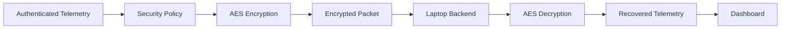

The important ordering is:

> **Authenticate → Authorize → Encrypt → Transmit**

rather than encrypting data before determining whether the packet is
trusted.

---

# 📊 End-to-End Data Flow

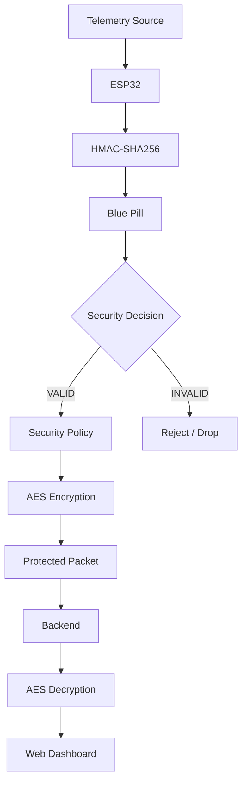

---

# 🔌 Hardware Communication

The ESP32 and Blue Pill communicate using UART.

### Current Configuration

| Parameter | Value |
|---|---|
| Interface | UART |
| Baud Rate | 115200 |
| Frame | 8N1 |
| ESP32 RX | GPIO16 |
| ESP32 TX | GPIO17 |
| Blue Pill Interface | USART1 |

### Connection

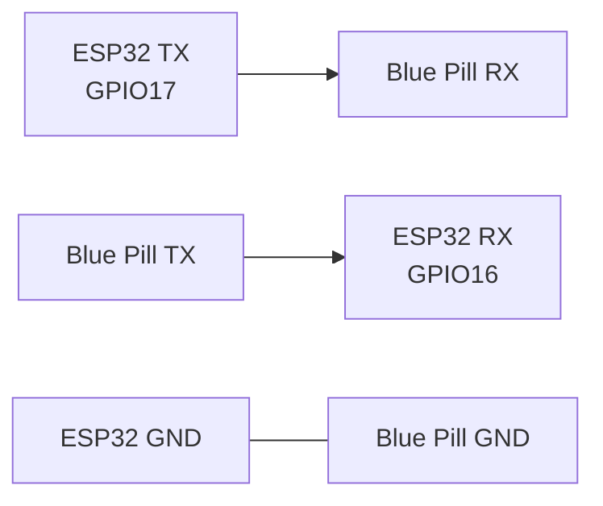

---

# 🌐 Backend & Dashboard

The laptop-side backend forms the final layer of the architecture.

Its responsibilities include:

- Receive protected telemetry
- Decrypt authorized packets
- Extract telemetry
- Record security events
- Display authentication status
- Display threat level
- Display active security policy
- Display encryption status
- Visualize telemetry
- Maintain packet/event history

### Dashboard Concept

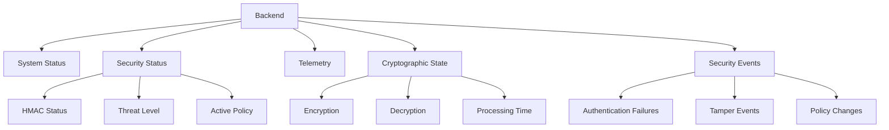

---

# 📦 Telemetry Structure

The current packet conceptually follows:

```text
PKT,1.0,MAIN_01,<counter>,<uptime>,<microseconds>,
<freeHeap>,GAS=<value>,GAS_STATUS=<status>,RUNNING
```

### Example

```text
PKT,1.0,MAIN_01,25,52310,52310432,183420,
GAS=724,GAS_STATUS=NORMAL,RUNNING
```

The actual telemetry fields are not tied to the MQ-2.

A deployment could instead contain:

```text
Temperature
Pressure
Humidity
Vibration
Current
Voltage
Flow
Gas
Machine State
...
```

---

# 🧱 Repository Structure

```text
FORTIS-ICS/
│
├── README.md
│
├── esp32/
│   ├── src/
│   │   └── main.cpp
│   └── README.md
│
├── bluepill/
│   ├── Core/
│   │   ├── Inc/
│   │   └── Src/
│   └── README.md
│
├── backend/
│   ├── server.py
│   ├── crypto.py
│   ├── protocol.py
│   ├── dashboard.py
│   └── requirements.txt
│
├── dashboard/
│   ├── assets/
│   ├── components/
│   └── README.md
│
├── docs/
│   ├── architecture/
│   ├── protocol/
│   ├── security/
│   └── figures/
│
└── LICENSE
```

---

# 🛠️ Technology Stack

### Embedded

- ESP32 DevKit V1
- STM32F103C8T6
- Arduino framework
- STM32 HAL
- C / C++

### Cryptography

- HMAC-SHA256
- AES
- mbedTLS cryptographic primitives

### Communication

- UART
- Structured serial security protocol

### Backend

- Python
- Packet processing
- Cryptographic decryption
- Telemetry processing

### Visualization

- Web dashboard
- Real-time system/security monitoring

---

# 🧪 Security Evaluation

FORTIS-ICS can be evaluated across four major categories.

## Authentication

- Valid packet acceptance
- Invalid packet rejection
- HMAC verification time

## Integrity

- Packet modification detection
- Authentication failure detection
- Attack-to-detection latency

## Cryptographic Performance

- AES execution time
- Encryption latency
- Decryption latency
- Cryptographic overhead

## Embedded Performance

- CPU utilization
- Memory consumption
- Packet throughput
- End-to-end latency

---

# 📈 Evaluation Model

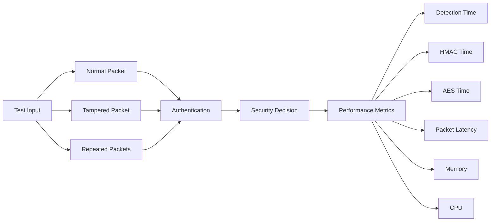

---

# 🛡️ Threat Model

FORTIS-ICS currently focuses primarily on **telemetry integrity**.

### Considered Threats

- Telemetry modification
- Packet tampering
- Unauthorized telemetry acceptance
- Authentication failures
- Integrity violations

### Current Demonstration

The implemented attack simulation specifically tests:

> **Modification of a telemetry packet after authentication while retaining
> the original authentication value.**

This allows the security coprocessor to detect that the packet no longer
corresponds to the authenticated message.

---

# 🔭 Extensibility

The architecture is designed to scale beyond a single sensor or node.

### Multiple Sensors

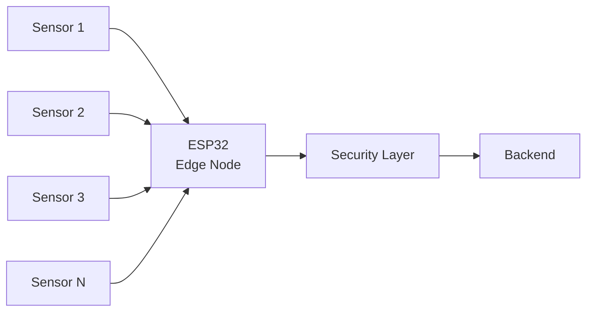

### Multiple Edge Nodes

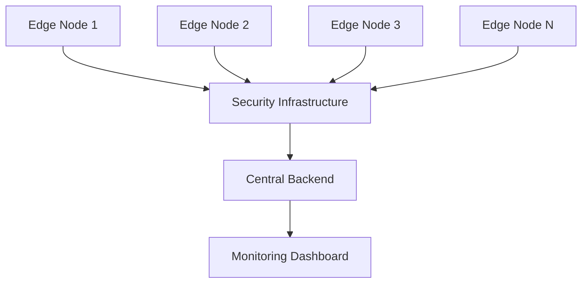

This allows the same security model to be applied across larger
Industrial IoT deployments.

---

# 🚀 Future Development

Potential extensions include:

- Adaptive cryptographic strength based on runtime conditions
- Replay protection
- Secure key provisioning
- Hardware-backed key storage
- Additional security policies
- Multi-node security management
- Remote policy updates
- Cloud-assisted threat intelligence
- Secure firmware updates
- Hardware-assisted cryptography
- Long-term security analytics
- Distributed industrial deployments

---

# 📋 Current Project Status

| Component | Status |
|---|:---:|
| ESP32 telemetry node | ✅ |
| UART communication | ✅ |
| HMAC-SHA256 generation | ✅ |
| Blue Pill security coprocessor | ✅ |
| HMAC verification | ✅ |
| Tamper simulation | ✅ |
| Threat classification | ✅ |
| Security policy response | ✅ |
| Example sensor telemetry | ✅ |
| AES protection | 🔄 |
| Backend decryption | 🔄 |
| Web dashboard | 🔄 |
| Performance evaluation | 🔄 |

---

# 🗺️ Development Roadmap

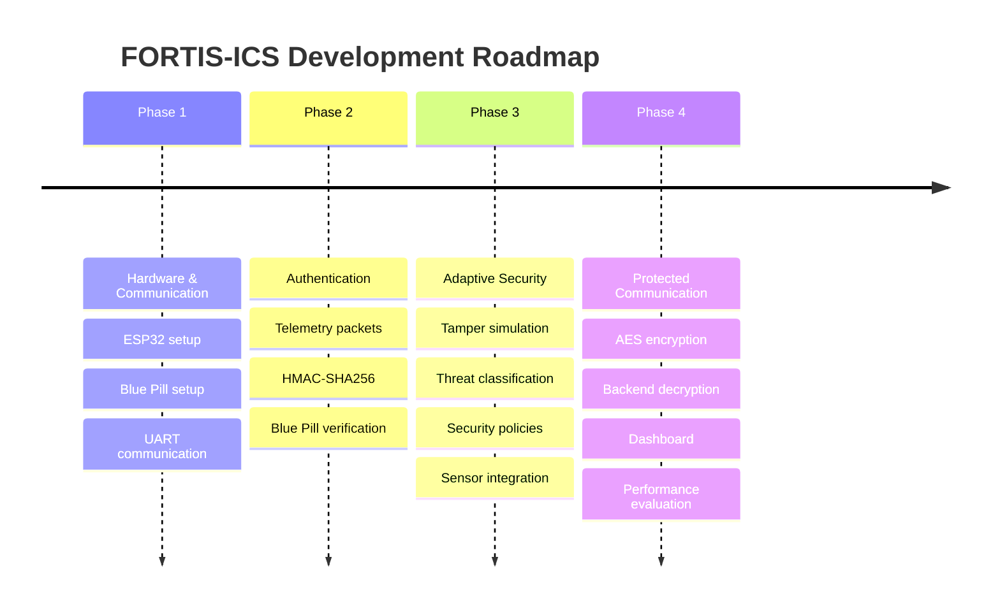

---

# 🎯 Final Architecture Goal

FORTIS-ICS aims to demonstrate a complete embedded security pipeline in
which the **security decision is separated from the application node**.


The core security principle is:

> **Authenticate first. Authorize cryptographic processing second. Protect
> the data only after the security decision has been established.**

---

# 📄 Project Scope

FORTIS-ICS is developed as an **academic embedded-security research
prototype** demonstrating the interaction between:

- Embedded telemetry
- Message authentication
- Dedicated security processing
- Adaptive security policies
- Cryptographic protection
- Secure communication
- Backend processing
- Security visualization

The architecture is intended to serve as a foundation for further research
into adaptive security mechanisms for Industrial Cyber-Physical Systems.

---

<p align="center">

### FORTIS-ICS

**Adaptive Cryptographic Security Architecture for Industrial Cyber-Physical Systems**

</p>
